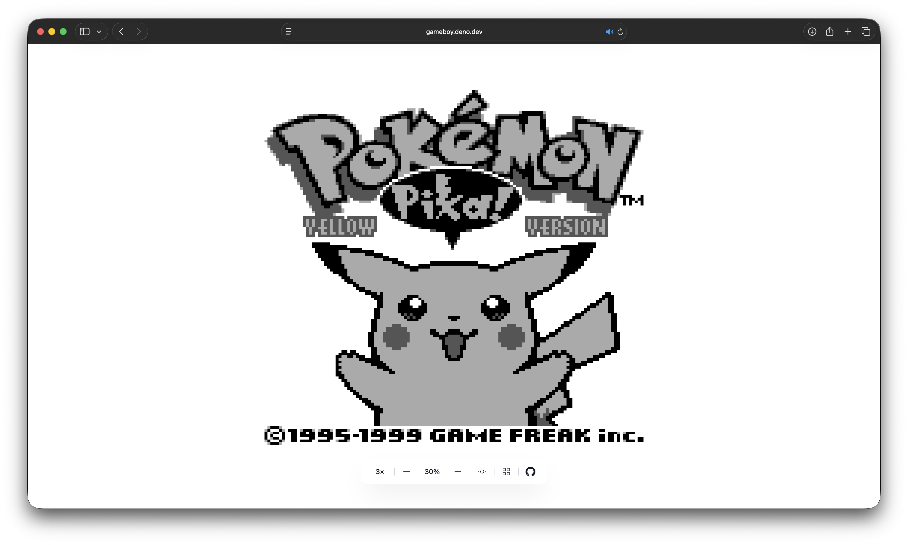
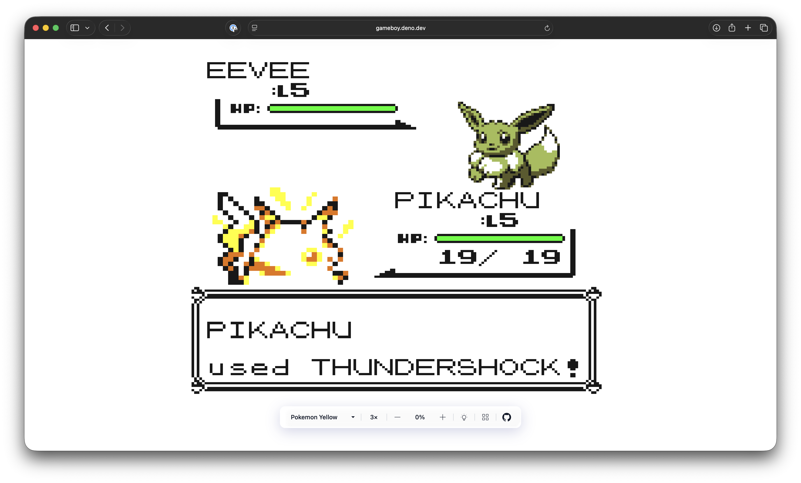
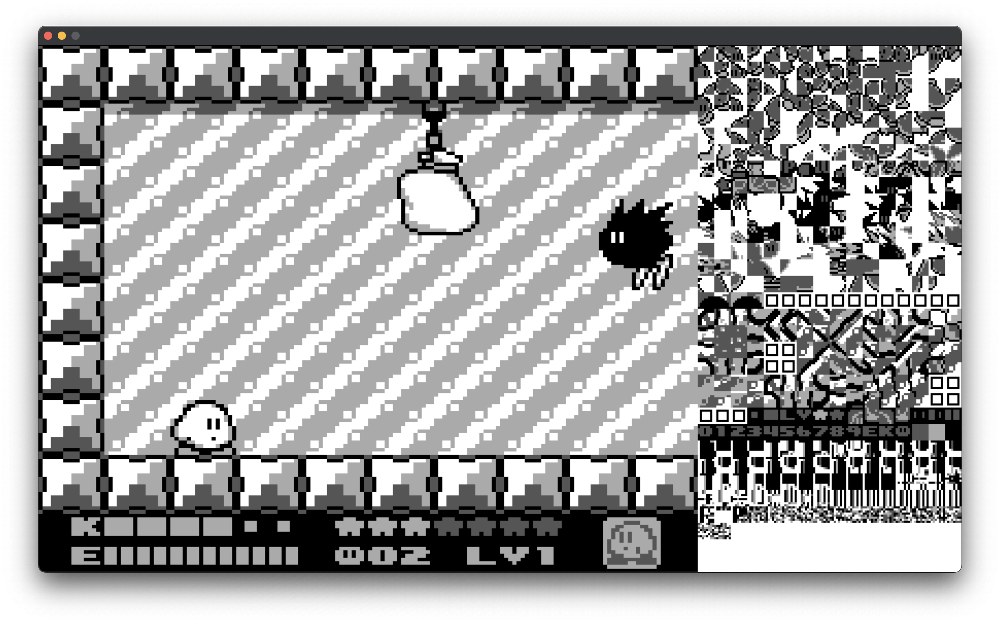

# gameboy

An accurate **gameboy** emulator written in C from scratch.


## development

In order to run the emulator, you need to have `cmake`, a build system like
`ninja` and a C compiler. `SDL2` is included as a submodule and will be compiled
along with the project.

1. Clone the repository

```bash
git clone --recurse-submodules git@github.com:Jabolol/gameboy.git .
```

2. Add the `ROMs` directory with the ROMs to be loaded in the web version

```bash
mkdir ROMs && cp /path/to/rom.gb ROMs
```

3. Compile the project

```bash
cmake -B build -G Ninja && cmake --build build
```

4. Run the emulator

```bash
./build/gameboy /path/to/rom.gb
```

## features

- [x] Bus (Memory Management)
- [x] CPU
- [x] PPU (Graphics)
- [x] Input (Joypad)
- [x] Timer
- [x] Interrupts (V-Blank, LCD, Timer, Serial, Joypad)
- [x] MBC1 - MBC7 (Memory Bank Controllers 1-7)
- [x] Save States (.sav files)
- [x] Sound (Square Wave, Wave, Noise)
- [x] Web version at [gameboy.deno.dev](https://gameboy.deno.dev/)

## controls

- `Arrow Keys` - D-Pad
- `A` - A
- `B` - B
- `U` - Volume Up
- `D` - Volume Down
- `Enter` - Start

## web version

The emulator is also available as a web version using `emscripten` and `deno`.
In order to run the web version, you need to have `deno` installed.

### game selection

The web version includes 13 preloaded games. Append `?game=${game}` to the URL
to load a specific game. If no game is specified, a random game will be loaded.

The full list of games can be found in [www/utils/gameLoader.ts](./www/utils/gameLoader.ts).

### ui controls

The web interface includes a control dock with the following features:

- **Canvas Scale** - Cycle between 1x, 2x, and 3x zoom levels (defaults to 2x
  on mobile, 3x on desktop)
- **Volume Control** - Adjust audio volume from 0 to 100% in 10% increments
- **Theme System** - Three available themes: `light`, `dark`, and `auto`
  (automatically detects the game's color palette by sampling canvas pixels and
  switches between light/dark themes accordingly in real-time)
- **Tiles Viewer** - Toggle visibility of internal gameboy tiles used to render
  the current frame
- **Persistent State** - All settings (scale, volume, theme, tiles) are saved
  to localStorage and restored on page load

### running locally

> [!TIP]
> To enable google analytics, set the `GA4_MEASUREMENT_ID` environment variable to
> your GA4 measurement ID.

The web version will bundle the ROMs available at `ROMs` directory and serve
them at `http://localhost:5173`.

```bash
deno task --cwd www dev
```



## screenshots

> [Legend of Zelda, The - Link's Awakening](https://gameboy.deno.dev/?game=zelda)


> [Pokemon - Yellow Version - Special Pikachu Edition](https://gameboy.deno.dev/?game=pokemon-yellow)



> [Dr. Mario](https://gameboy.deno.dev/?game=dr-mario)


> [Mega Man - Dr. Wily's Revenge](https://gameboy.deno.dev/?game=megaman-willy)


> [Contra - The Alien Wars](https://gameboy.deno.dev/?game=contra)


> [Kirby - Dream Land](https://gameboy.deno.dev/?game=kirby-dream)


> [Kirby - Dream Land 2](https://gameboy.deno.dev/?game=kirby-dream-2)



> [Tetris](https://gameboy.deno.dev/?game=tetris)


## resources

- [Gameboy CPU Manual](http://marc.rawer.de/Gameboy/Docs/GBCPUman.pdf): A
  comprehensive guide to the Gameboy CPU.
- [Gameboy Opcodes](https://www.pastraiser.com/cpu/gameboy/gameboy_opcodes.html):
  List of all opcodes for the Gameboy CPU.
- [Gameboy Pan Docs](https://gbdev.io/pandocs/): A detailed guide to the Gameboy
  hardware.

## license

This project is licensed under the MIT License - see the [LICENSE](./LICENSE)
file for details.
