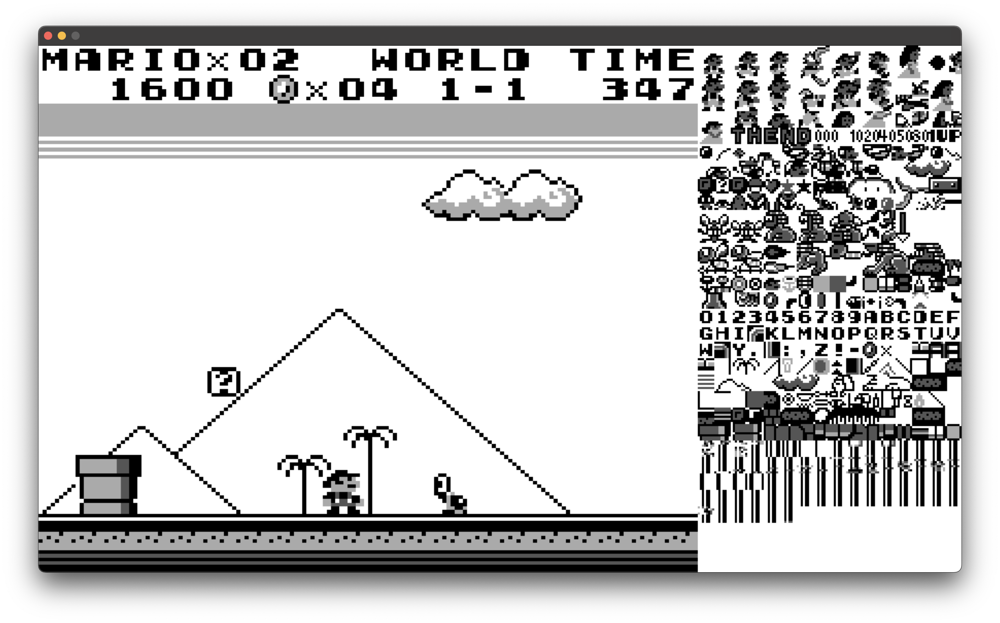
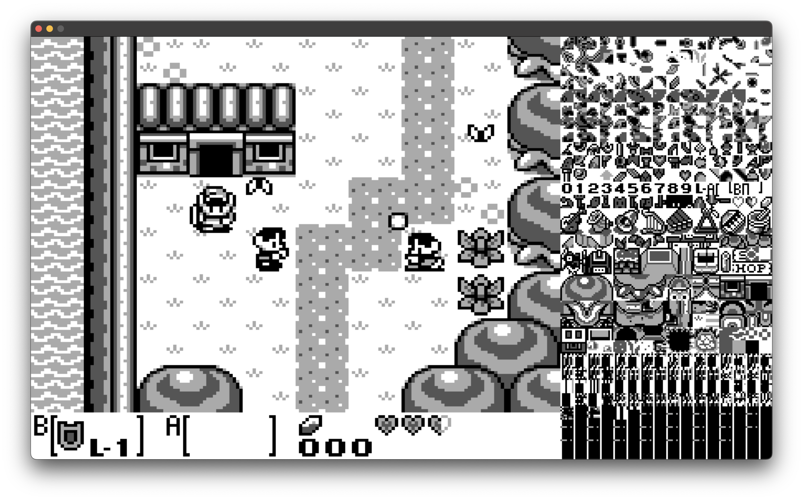
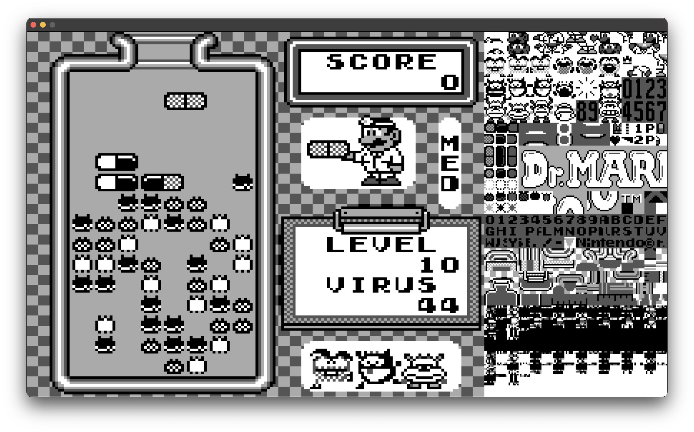
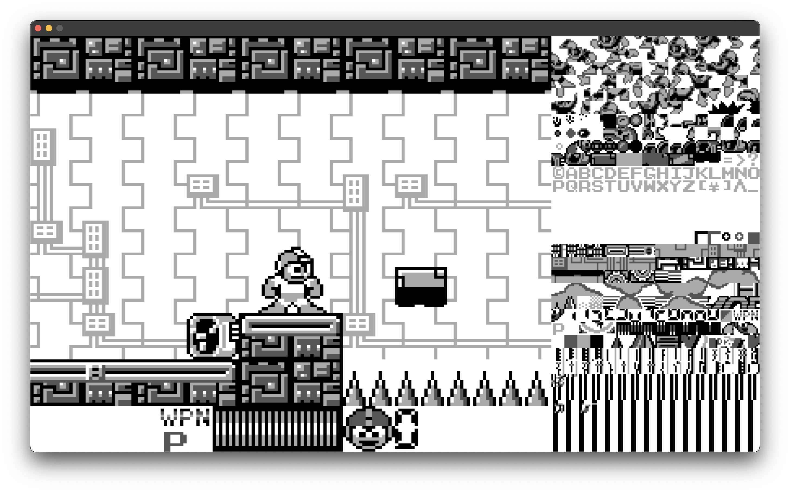
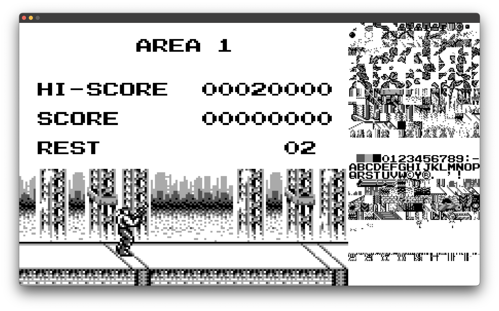
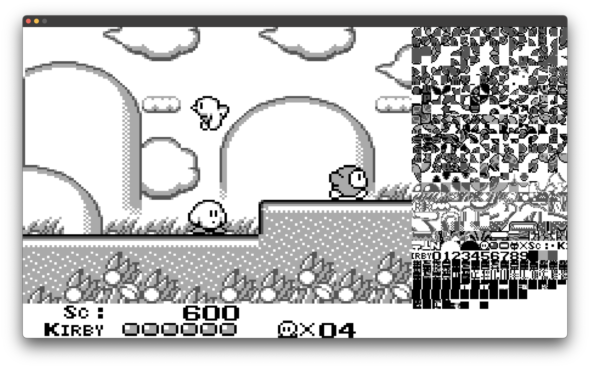
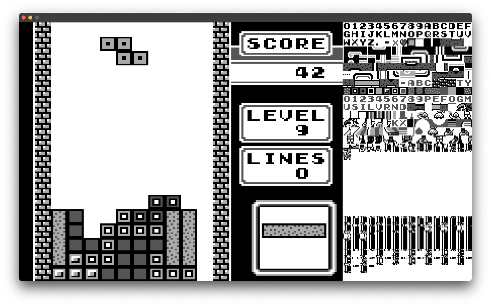
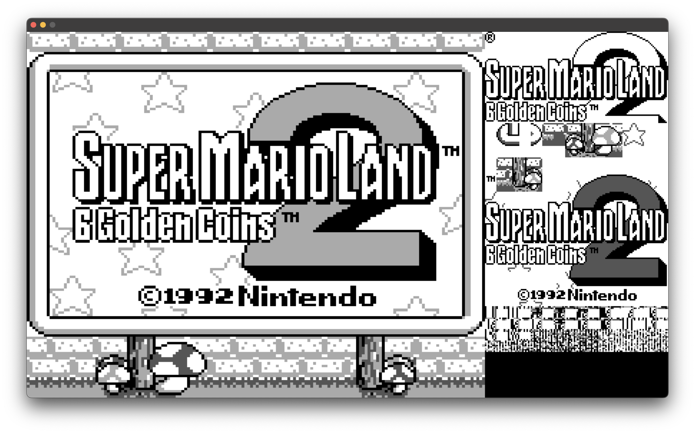

# gameboy

An accurate **gameboy** emulator written in C from scratch.



## development

In order to run the emulator, you need to have `SDL2` installed on your machine,
as well as `build-essential`.

1. Clone the repository

```bash
git clone git@github.com:Jabolol/gameboy.git .
```

2. Compile the project

```bash
make
```

3. Run the emulator

```bash
./gameboy /path/to/rom.gb
```

## features

> [!NOTE]\
> This emulator is still in development, future releases will include more
> features.

- [x] Bus (Memory Management)
- [x] CPU
- [x] PPU (Graphics)
- [ ] APU (Audio)
- [x] Input (Joypad)
- [x] Timer
- [x] Interrupts (V-Blank, LCD, Timer, Serial, Joypad)
- [ ] MBC* (Memory Bank Controllers - Only `MBC1` is supported)
- [x] Save States (.sav files)

## controls

- `Arrow Keys` - D-Pad
- `A` - A
- `B` - B
- `Enter` - Start

## screenshots

> Legend of Zelda, The - Link's Awakening



> Dr. Mario



> Mega Man: Dr. Wily's Revenge



> Contra - The Alien Wars



> Kirby - Dream Land



> Tetris



> Super Mario Land 2 - 6 Golden Coins



## resources

- [Gameboy CPU Manual](http://marc.rawer.de/Gameboy/Docs/GBCPUman.pdf): A
  comprehensive guide to the Gameboy CPU.
- [Gameboy Opcodes](https://www.pastraiser.com/cpu/gameboy/gameboy_opcodes.html):
  List of all opcodes for the Gameboy CPU.
- [Gameboy Pan Docs](https://gbdev.io/pandocs/): Comprehensive documentation on
  the Gameboy hardware.

## license

This project is licensed under the MIT License - see the [LICENSE](./LICENSE)
file for details.
